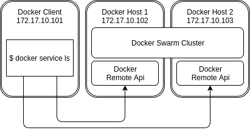

Ansible role for remote access to docker swarm cluster
======================================================

This role creates certificates for CA, client and servers and deploy server container to swarm manager nodes or just docker nodes.

Pick up also another [ansible roles](https://galaxy.ansible.com/Bessonov/) :)

Requirements
------------

Ansible 2.3 and installed docker on paticipiated hosts.

Example Playbook
----------------

Install role globally with:

    ansible-galaxy install Bessonov.docker-remote-api

or locally:

    ansible-galaxy install --roles-path roles Bessonov.docker-remote-api

Inventory:

    [managers]
    node-1
    node-2
    node-3

Playbook:

    # docker must be installed before
    # you can use any role for docker installation
    - hosts: managers
      roles:
        - role: Bessonov.docker

    - hosts: managers
      roles:
        - role: Bessonov.docker-remote-api

          # optional: override default parameters, see `defaults/main.yml`
          docker_remote_certs_server_additional_subjects:
            - "DNS:{{ ansible_hostname }}"
            - "IP:192.168.0.1"

After that you can connect to your docker instances with secured connection:

    docker --tlsverify --tlscacert=certs/ca/ca.pem --tlscert=certs/client/client-cert.pem --tlskey=certs/client/client-key.pem -H 192.168.0.1:2376 info

Look at [Protect the Docker daemon socket](https://docs.docker.com/engine/security/https/) for additional information.

See also [remote-client example](https://github.com/Bessonov/ansible-role-docker-remote-api/tree/master/examples/remote-client/):

You need to install [vagrant](https://www.vagrantup.com/) and [ansible](https://www.ansible.com/). Then you can start VMs with `./start.sh` and some minutes later go to http://localhost:8080.

To access docker swarm cluster login into the client and adjust docker cli to work with swarm cluster:

    vagrant ssh ubuntu-01
    export DOCKER_HOST=tcp://172.17.10.102:2376 DOCKER_TLS_VERIFY=1
    docker service ps

Shutdown with `./destroy.sh`

Credits
-------

This role is inspired by [paulczar/omgwtfssl](https://github.com/paulczar/omgwtfssl) and [kekru/docker-remote-api-tls](https://github.com/kekru/docker-remote-api-tls), but doesn't need to open docker.sock to the world.

License
-------

The MIT License (MIT)

Copyright (c) 2017, Anton Bessonov

Permission is hereby granted, free of charge, to any person obtaining a copy
of this software and associated documentation files (the "Software"), to deal
in the Software without restriction, including without limitation the rights
to use, copy, modify, merge, publish, distribute, sublicense, and/or sell
copies of the Software, and to permit persons to whom the Software is
furnished to do so, subject to the following conditions:

The above copyright notice and this permission notice shall be included in
all copies or substantial portions of the Software.

THE SOFTWARE IS PROVIDED "AS IS", WITHOUT WARRANTY OF ANY KIND, EXPRESS OR
IMPLIED, INCLUDING BUT NOT LIMITED TO THE WARRANTIES OF MERCHANTABILITY,
FITNESS FOR A PARTICULAR PURPOSE AND NONINFRINGEMENT. IN NO EVENT SHALL THE
AUTHORS OR COPYRIGHT HOLDERS BE LIABLE FOR ANY CLAIM, DAMAGES OR OTHER
LIABILITY, WHETHER IN AN ACTION OF CONTRACT, TORT OR OTHERWISE, ARISING FROM,
OUT OF OR IN CONNECTION WITH THE SOFTWARE OR THE USE OR OTHER DEALINGS IN
THE SOFTWARE.
